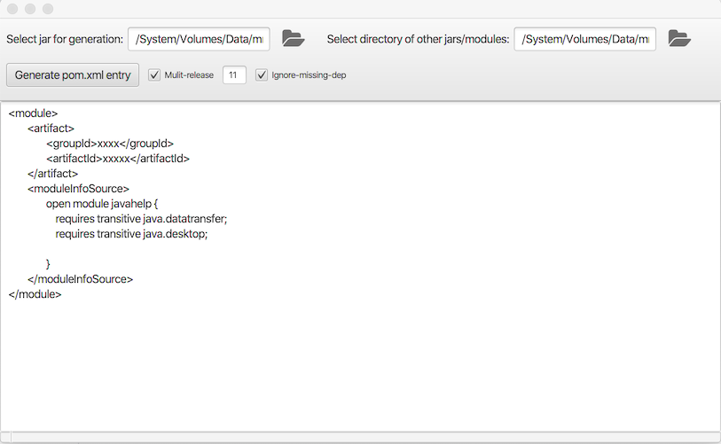

# ModitectGen
Generator of module-info via jdeps for moditect maven plugin
The tool helps to get the module-info content which can be used with moditect inside of the pom.xml

# Options:
- jar file to specify to generate the moditect xml
- directory where the all libraries can be found for the appliction
- Multi-release if you target with your app more than one JDK release or if one lib is already requesting that
- Ignore deps means that libs needed for compile time are ignored

# Example:
- select jar file for javahelp-2.0.05.jar which is a jar compiled without a module-info.java
- select the directory of you app which is using moditect e.g. /ModitectGen/ModitectGen/target/modules where all other libs are stored
- Hit "Generate pom.xml entry"
- The result looks like:

